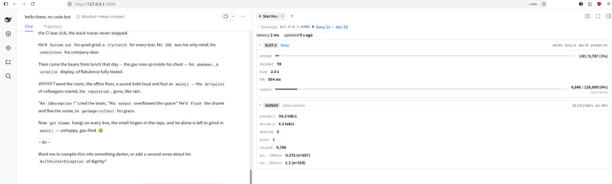
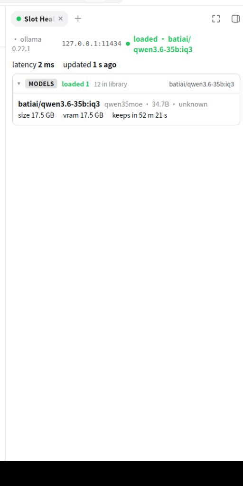
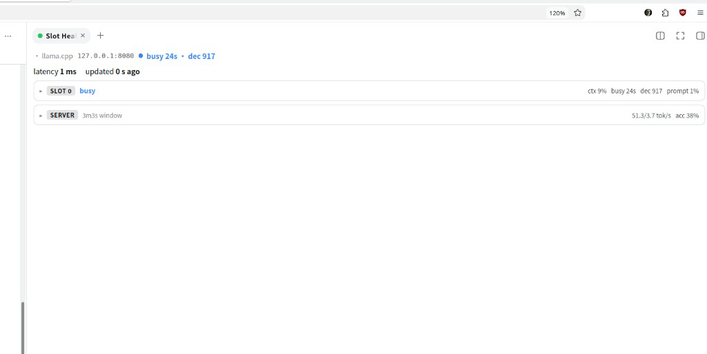
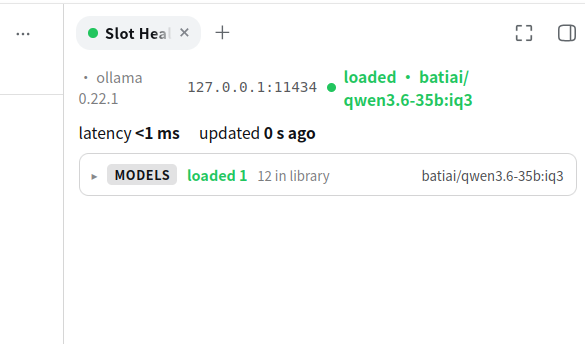
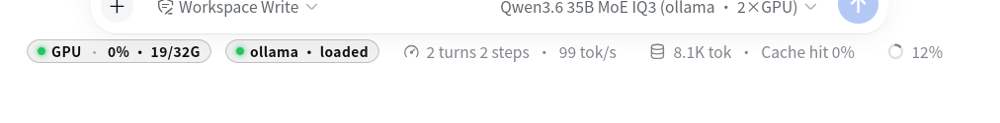

# dsh-slot-health

A live health pane for local LLM endpoints in the **DeepSeek Harness** web UI.
One rightbar tab, one second per sample, engines named by fingerprint — so a
busy llama.cpp slot or a resident Ollama model reads as clearly as a dashboard
instead of a raw dump.

Built and verified against live backends on the same box: **llama.cpp** on
`:8080` (Qwen3.8 27B) and **Ollama** on `:11434` (including dual-GPU
`OLLAMA_SCHED_SPREAD` with a 35B MoE).

## Requirements

- DeepSeek Harness web profile (`dsh web`).
- A local OpenAI-compatible / native endpoint to watch:
  - **llama.cpp** `llama-server` (full support), or
  - **Ollama** (honest up-states + MODELS card), or
  - anything else reachable (fingerprinted as `unknown` / stub).

Configure the origin in `cordis.patch.yml` (default `http://127.0.0.1:8080`).
Point it at `:11434` when watching Ollama.

---

## Screenshots

Light theme, matching the DSH default.

| llama.cpp (busy, expanded) | Ollama (loaded, MODELS open) |
| --- | --- |
|  |  |

| llama.cpp (cards collapsed) | Ollama MODELS collapsed |
| --- | --- |
|  |  |

| Dock chip · llama | Dock chip · ollama |
| --- | --- |
|  |  |

## What you see

### llama.cpp

```
Slot Health   llama.cpp  127.0.0.1:8080   · busy 2s · dec 59
  latency 2 ms · updated 0 s ago

SLOT 0 · busy
  ctx 8% · busy 2s · dec 59 · prompt 1%
  prompt   130 / 9,787 (1%)     ████░░░░░░
  decoded  59
  busy     2.0 s
  ttft     954 ms
  context  9,846 / 128,000 (8%) · 118,154 free

SERVER · 2m42s window
  58.3 / 4.2 tok/s · acc 38%
  prompt_tok/s · decode_tok/s · deferred · active · ctx peak
  acceptance + length lifetime figures from /metrics
```

- **Busy from `is_processing` only** — never from retained `n_prompt_tokens`
  (those stay high while idle).
- **TTFT + busy-age latches** computed host-side (the `/slots` payload has no
  timestamps).
- **Wedged heuristic**: prompt fully processed, zero decodes, busy ≥ 300 s
  (DSH `streamIdleTimeoutMs`) — called out in red, not silently “busy forever”.
- **SERVER card** from Prometheus `/metrics` (prompt/decode rates, deferred,
  active, context peak, lifetime acceptance/length). Figures use the sample
  envelope — bare lifetime `.value` is never mistaken for a percentage.

### Ollama

```
Slot Health   ollama 0.22.1  127.0.0.1:11434   · loaded · model…
  latency <1 ms · updated 0 s ago

MODELS · 1 loaded / 12 in library
  batiai/qwen3.6-35b:iq3
    qwen35moe · 34.7B · 17.5 GB · VRAM 17.5 GB · keeps in 52 m …
```

- Honest states — **not** llama vocabulary:
  - `up-no-model` — reachable, `/api/ps` → `{"models":[]}` (up, nothing loaded;
    not an error).
  - `up-loaded` — ≥1 model resident. **Resident ≠ busy** — keep-alive evicts
    after the TTL; the dock chip says `ollama · loaded`, never `busy`.
- MODELS card: resident details + library count from `/api/tags`.

### Fingerprint (never guessed)

| Backend | Oracle shape |
| --- | --- |
| `llama-cpp` | `/health` → `{"status":"ok"}` and `/slots` → bare JSON array |
| `ollama` | `/api/version` → object with string `version` |
| `vllm` | `/metrics` text contains a `vllm:` series (stub — no dedicated sections yet) |
| `unknown` | reachable, none of the above |

The engine word appears on the pane header and the dock chip
(`llama · busy`, `ollama · loaded`).

## Architecture

This is a **dual-face plugin package**: one npm package, two runtimes.

- **Host face** (`lib/index.js`, ESM) — registers the plugin, owns a 1 s sampling
  loop (`SAMPLE_INTERVAL_MS = 1000`), probes the configured origin, and serves a
  JSON snapshot at `GET /api/dsh-slot-health` on the same origin as the page.
- **Client face** (`lib/client.js`, CJS closure factory) — loaded by the web
  client via `window.__ModuleLoader__.load({ id, factory })`. Self-chaining 1 Hz
  `fetch` (no-store, abortable), renders the **Slot Health** rightbar tab and
  the footer dock chip.
- **Glue** — `cordis.patch.yml` inserts one Loader row; the browser half is
  discovered from the `dsh.client` declaration in `package.json`.

Client constraints, honored: only frozen `PLATFORM_MODULES` may be required at
runtime (react, cordis, client store, ui slots/primitives/dockkit); everything
else is inlined by esbuild. Presentation is **inline styles only** — no CSS
files in the bundle. The plugin is **read-only** toward the origin (no
load/unload/kill).

```
dsh-slot-health/
├── package.json          # dual-face exports: "." (host) and "./client" (browser)
├── build.mjs             # esbuild, two configs (host ESM + client CJS closure factory)
├── cordis.patch.yml      # Loader row + origin
├── media/                # README screenshots
├── src/
│   ├── host/
│   │   ├── index.ts      # plugin registration + sampling loop
│   │   ├── route.ts      # GET /api/dsh-slot-health
│   │   ├── collect.ts    # probes + fingerprint dispatch
│   │   ├── fingerprint.ts
│   │   ├── latch.ts      # busy-age / TTFT latches
│   │   ├── metrics.ts    # /metrics parse → SERVER card
│   │   └── ollama.ts     # /api/ps + /api/tags
│   ├── client/
│   │   ├── index.tsx     # slot + dock injection
│   │   ├── SlotBody.tsx  # pane: SLOT / SERVER / MODELS cards
│   │   ├── SlotTitle.tsx # tab chip
│   │   └── SlotDockChip.tsx
│   └── shared/
│       └── types.ts      # HealthSnapshot / SlotSample / Backend
└── lib/                  # prebuilt output (committed for install-without-toolchain)
```

## Install

Requires **DeepSeek Harness** with a web profile and a local endpoint to watch.

### From GitHub (users)

```sh
dsh plugin --profile web add github:janpauldahlke/dsh-slot-health
# restart dsh web (or rely on live patch reload), then hard-refresh the browser
```

`lib/` is committed, so install does not require a local TypeScript/esbuild
toolchain.

Point `origin` in the installed `cordis.patch.yml` (or your profile override) at
the endpoint you want:

```yaml
config:
  origin: http://127.0.0.1:8080   # llama.cpp
  # origin: http://127.0.0.1:11434  # Ollama
```

### From a git checkout (developers)

```sh
git clone https://github.com/janpauldahlke/dsh-slot-health.git
cd dsh-slot-health
npm install          # prepare builds lib/ if toolchain present
node build.mjs       # optional: force rebuild → lib/index.js + lib/client.js

# wire into your web profile (absolute path; link: dep + bundle entry)
dsh plugin --profile web add "$PWD"
```

That updates `~/.dsh/profiles/web/package.json` roughly to:

```json
"dependencies": {
  "dsh-slot-health": "link:/abs/path/to/dsh-slot-health"
},
"dsh": {
  "profile": {
    "bundles": [
      "@deepseek-ai/dsh-base",
      "@deepseek-ai/dsh-web-app",
      "dsh-slot-health"
    ]
  }
}
```

Restart `dsh web`, hard-refresh. The rightbar **Slot Health** tab and footer
dock chip should appear.

### Dev loop

```sh
# edit src/ → rebuild (profile already link:s this tree)
node build.mjs
# host half often hot-reloads with patchReload: live; client half: hard-refresh
```

If the profile cannot resolve the package name:

```sh
ln -sfn "$PWD" "$HOME/.dsh/profiles/web/node_modules/dsh-slot-health"
```

Do **not** link only into a harness monorepo `node_modules` — Cordis resolves
from the **profile**.

### Verify

```sh
dsh --profile web --dump-config | grep dsh-slot-health
curl -s http://127.0.0.1:3080/api/dsh-slot-health | head   # adjust port
# expect JSON: state, backend, slots[] and/or ollama, optional metrics
```

Remove:

```sh
dsh plugin --profile web remove dsh-slot-health
```

## How this was built

Closed-loop iteration on live hardware: research the DSH out-of-tree plugin
contract, scaffold a dual-face package, build a read-only sampler against
llama.cpp `/health` `/slots` `/metrics`, add Ollama fingerprint + MODELS, polish
cards/tooltips/dock chip, and re-check every pass on a dedicated acceptance
port — without touching sacred ports (`:3080` main dsh, `:8080` llama-server,
`:11434` ollama). Companion to [`dsh-gpu-monitor-nvml`](https://github.com/janpauldahlke/dsh-gpu-monitor-nvml)
on the same lab.

### Authors

Built as a **human ↔ local-model pair**, not “AI did it” and not “human only
reviewed.”

- **Jan (hagbardCeline)** — software engineer. Set the goal and honesty rules
  (fingerprint by shape, Ollama ≠ llama vocabulary, never lie about busy),
  drove the accept/reject loop against real endpoints, killed bad paths, and
  owned the final “ship this” call.
- **Qwen3.8 27B Q6 HauHau** (coauthor) — wrote the bulk of the implementation
  under that loop: host sampler, client UI, build glue. Served by llama.cpp
  across dual NVIDIA GPUs (RTX 4080 SUPER + RTX A4000). Ollama smoke used
  `batiai/qwen3.6-35b:iq3` with `OLLAMA_SCHED_SPREAD`.
- **Hardware** — Ryzen 7 7800X3D, 61 GiB RAM, dual 16 GiB NVIDIA GPUs.

The interesting part is the recursion: an agent helping build a health pane for
the endpoint it is running on, with a human in the loop the whole way.

---

**License:** MIT · [Contributing](CONTRIBUTING.md)
